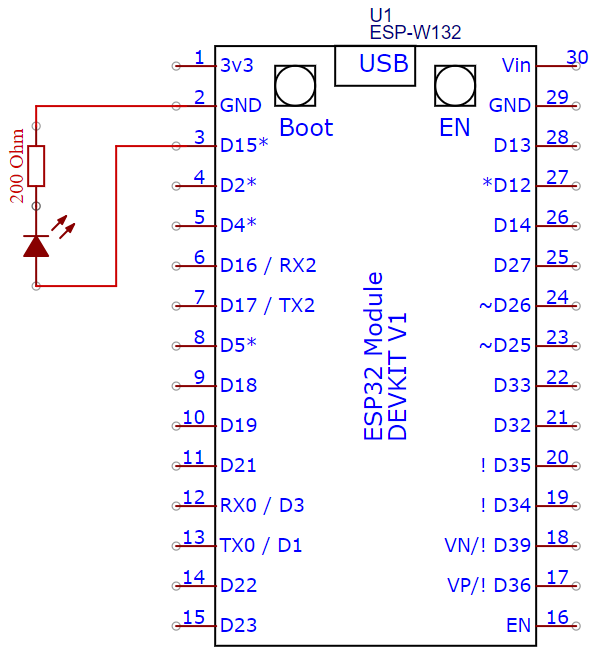
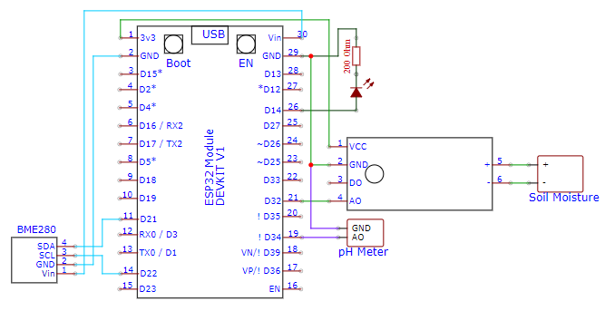

# System Information

This page contains system information that may be helpfull on developing/using this system
## Schematic Diagram
Below is the schematic diagram for all of the devices. The first schematic is for ESP-Master 
 
The schematic below is use for ESP-Slave which function as reading sensor data and connected to 3 sensors which is BME280, Soil Moisture and pH Meter 
 
The schematic below is use for ESP-Slave Output which function as the actuator for the system using water solenoid valve and waterflow sensor 
 
This is the overall of how the device connected 
 

## System Design
In this diagram explained how the data flows from input and outputed to ESP-Slave Output. The data collected from the sensors will be send using ESP-NOW to ESP-Master, then ESP-Master will send the data using MQTT to Raspberry Pi to be process using node-RED and produce 3 output which is saving data to SQLite database, sending notification to Whatsapp and sending command to inject liquid from ESP-Slave Output by sending it via ESP-Master 
 

## Workflow
In this system there are 8 features :
1. Monitoring System
2. Warning Automation system
3. Fuzzy Shallot Warning Automation System
4. pH Balancer System
5. Manual Injection System
6. Data Logging System
7. Whatsapp Notification Warning
8. Chart Hourly, Daily and Weekly 

Below is the workflow diagram of this devices 

