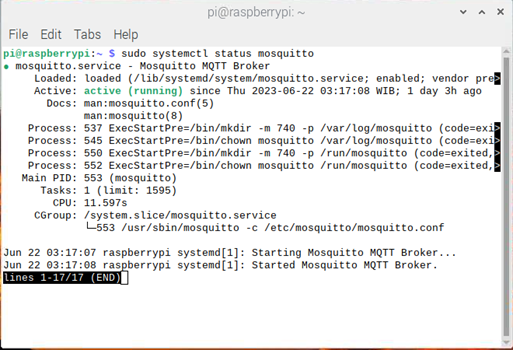

# Mosquitto Installation

1. Run this command to install mosquitto broker<br />
```sudo apt update -y && sudo apt install mosquitto mosquitto-clients -y```<br />
2. Start mosquitto broker using this command
   ```sudo systemctl start mosquito```
3. Check mosquitto status, if active then the installation is success
   ```sudo systemctl status mosquitto```<br />


